# 🏛️ Framework Architecture

This document provides a comprehensive overview of the Agent Forge framework architecture, design principles, and core concepts.

## 📋 **Table of Contents**

- [Architecture Overview](#architecture-overview)
- [Core Components](#core-components)
- [Design Principles](#design-principles)
- [Framework Layers](#framework-layers)
- [Component Interaction](#component-interaction)
- [Extension Points](#extension-points)

---

## 🎯 **Architecture Overview**

Agent Forge is designed as a **modular, self-contained framework** for building autonomous AI web agents. The architecture prioritizes developer productivity, maintainability, and extensibility.

### **High-Level Architecture**

```
┌─────────────────────────────────────────────────────────────┐
│                    Developer Interface                      │
├─────────────────────────────────────────────────────────────┤
│  CLI Interface  │  Configuration  │  Documentation         │
├─────────────────────────────────────────────────────────────┤
│                    Agent Layer                              │
├─────────────────────────────────────────────────────────────┤
│  BaseAgent      │   Examples      │   Custom Agents        │
├─────────────────────────────────────────────────────────────┤
│                 🤝 Integration Layer                        │
├─────────────────────────────────────────────────────────────┤
│ Masumi-Ziggurat │ Agent Registry  │ Reward System │ Bridge │
├─────────────────────────────────────────────────────────────┤
│                    Core Framework                           │
├─────────────────────────────────────────────────────────────┤
│   AI Utils      │  Web Automation │  Database  │  ML Tools  │
├─────────────────────────────────────────────────────────────┤
│                  External Integrations                     │
├─────────────────────────────────────────────────────────────┤
│  Steel Browser  │  NMKR API      │  IPFS      │  Cardano    │
│ Masumi Network  │ Ziggurat ICP   │  TON Chain │ Multi-Chain │
└─────────────────────────────────────────────────────────────┘
```

### **Key Architectural Decisions**

1. **Self-Contained Design** - All dependencies included in the framework
2. **Async-First Architecture** - Built for modern async/await patterns
3. **BaseAgent Foundation** - Consistent interface for all agent development
4. **🤝 Integration Layer** - **NEW** Masumi-Ziggurat bridge enabling AI agent economy participation
5. **CLI-Driven Interface** - Simple command-line management
6. **Modular Utilities** - Clean separation of framework capabilities
7. **Multi-Chain Support** - Native blockchain integration for rewards and verification

---

## 🔧 **Core Components**

### **1. 🤝 Integration Layer (NEW)**

The Integration Layer bridges Agent Forge with external AI agent economies, enabling agents to discover tasks, earn rewards, and participate in decentralized AI marketplaces.

**Location:** `src/core/integrations/`

**Core Integration Services:**
```python
# Masumi-Ziggurat Bridge - Main integration coordinator
class MasumiZigguratBridge:
    async def discover_explainable_tasks() -> List[Dict]
    async def process_explainable_task() -> ExplainableTaskResult
    async def submit_custom_explanation() -> ExplainableTaskResult

# Registry Synchronization - Cross-platform agent profiles
class RegistrySyncService:
    async def register_agent() -> AgentProfile
    async def sync_agent_profile() -> AgentProfile

# Explainable Rewards - Quality-based reward calculation
class ExplainableRewardsSystem:
    def calculate_reward() -> ExplanationReward
    def evaluate_explanation_quality() -> ExplanationMetrics

# Unified Payment - Multi-chain payment processing  
class UnifiedPaymentService:
    async def process_ai_service_payment() -> UnifiedPayment
    async def process_cross_chain_transfer() -> Tuple[UnifiedPayment, UnifiedPayment]

# Blockchain Verification - Cross-chain verification
class BlockchainVerificationBridge:
    async def verify_ai_explanation() -> CrossChainVerification
    async def verify_cross_chain_consensus() -> Dict[str, Any]
```

**Integration Architecture:**
```
Integration Layer Components:
├── MasumiZigguratBridge     # Main coordinator between platforms
├── RegistrySyncService      # Agent profile synchronization
├── ExplainableRewardsSystem # Quality-based reward calculation
├── UnifiedPaymentService    # Multi-chain payment processing
├── BlockchainVerificationBridge # Cross-chain verification
└── IntegrationConfig        # Environment configuration management
```

**Key Features:**
- **Task Discovery** - Find explainable AI tasks from Masumi Network marketplace
- **Quality Rewards** - Earn MASUMI tokens based on explanation quality (Bronze/Silver/Gold/Platinum tiers)
- **Cross-Chain Verification** - Verify AI explanations across ICP, Cardano, TON, Ethereum, Bitcoin
- **Agent Registry Sync** - Synchronized agent profiles across Masumi and Ziggurat platforms
- **Economic Incentives** - Quality-based multipliers (1x to 3x) encouraging high-quality explanations

### **2. BaseAgent Foundation**

The heart of the framework is the `BaseAgent` abstract base class that provides a standard interface for all agents.

**Location:** `core/agents/base.py`

**Key Features:**
```python
class BaseAgent(ABC):
    # Lifecycle Management
    async def initialize(self) -> bool
    async def cleanup(self) -> None
    @abstractmethod
    async def run(self, *args, **kwargs) -> Any
    
    # Status and Monitoring
    def is_ready(self) -> bool
    def get_status(self) -> Dict[str, Any]
    
    # Configuration and Logging
    self.config: Dict[str, Any]
    self.logger: logging.Logger
```

**Design Patterns:**
- **Template Method Pattern** - Standard lifecycle with customizable steps
- **Strategy Pattern** - Different agent implementations with same interface
- **Observer Pattern** - Built-in logging and status reporting

### **2. CLI Interface**

The command-line interface provides agent management and execution capabilities.

**Location:** `cli.py`

**Architecture:**
```python
CLI Architecture:
├── Argument Parsing (argparse)
├── Agent Discovery (dynamic import)
├── Configuration Management
├── Execution Engine
└── Error Handling & Reporting
```

**Key Features:**
- **Dynamic Agent Discovery** - Automatically finds agents in examples/
- **Flexible Configuration** - Support for command-line args and config files
- **Comprehensive Error Handling** - Clear error messages and debugging
- **Extensible Commands** - Easy to add new CLI operations

### **3. Core Utilities System**

Self-contained utilities providing framework capabilities without external dependencies.

**Location:** `core/shared/`

**Architecture:**
```
core/shared/
├── ai/                   # AI and LLM Integration
│   ├── embeddings/       # Vector embeddings and similarity
│   ├── prompts/          # LLM prompt management
│   ├── schemas/          # Data validation schemas
│   └── models/           # AI model integration
├── database/             # Database Operations
│   ├── client/           # Database clients
│   ├── search/           # Search optimization
│   ├── models/           # Data models
│   └── migrations/       # Schema management
├── ml/                   # Machine Learning
│   ├── training/         # Model training
│   ├── inference/        # Model inference
│   ├── preprocessing/    # Data processing
│   └── evaluation/       # Model evaluation
├── auth/                 # Authentication & Security
│   ├── credentials/      # Credential management
│   ├── tokens/           # Token handling
│   └── encryption/       # Security utilities
├── blockchain/           # ✅ Blockchain Integration (IMPLEMENTED)
│   ├── nmkr/            # NMKR Studio API integration
│   ├── cardano/         # Cardano blockchain utilities
│   ├── ipfs/            # IPFS decentralized storage
│   └── verification/    # Cryptographic proof generation
├── integrations/         # 🤝 AI Agent Economy Integration (NEW)
│   ├── masumi_ziggurat_bridge.py      # Main integration bridge
│   ├── registry_sync_service.py       # Cross-platform agent sync
│   ├── explainable_rewards_system.py  # Quality-based rewards
│   ├── unified_payment_service.py     # Multi-chain payments
│   ├── blockchain_verification_bridge.py # Cross-chain verification
│   └── integration_config.py          # Configuration management
└── web/                  # Web Automation
    ├── browsers/         # Browser automation (Steel Browser)
    ├── scraping/         # Web scraping utilities
    └── requests/         # HTTP request management
```

**Design Principles:**
- **Cohesion** - Related functionality grouped together
- **Loose Coupling** - Minimal dependencies between utility modules
- **Interface Consistency** - Standard patterns across all utilities
- **Async Support** - Built for async/await usage patterns

### **4. Example Library**

Comprehensive collection of working agent implementations demonstrating framework capabilities.

**Location:** `examples/`

**Agent Categories:**
- **Navigation Agents** - Basic web navigation and data extraction (`SimpleNavigationAgent`)
- **Data Processing Agents** - Content extraction and analysis (`TextExtractionAgent`, `DataCompilerAgent`)
- **Integration Agents** - API integration and cross-system communication (`ExternalSiteScraperAgent`)
- **⛓️ Blockchain Agents** - **✅ IMPLEMENTED** Verifiable execution with NFT proof generation
  - **NMKRAuditorAgent** - Complete Cardano blockchain verification system
  - **Proof-of-Execution** - End-to-end audit trails with NMKR integration
  - **CIP-25 Compliance** - Cardano NFT metadata standards implementation
  - **IPFS Integration** - Decentralized storage for audit logs
- **🤝 Integration Agents** - **✅ NEW** AI agent economy participation and rewards
  - **MasumiZigguratBridge** - Task discovery and explainable AI processing
  - **ExplainableRewardsAgent** - Quality-based MASUMI token earnings
  - **CrossChainVerificationAgent** - Multi-chain explanation verification
  - **AgentRegistrySync** - Cross-platform agent profile management

---

## 🎨 **Design Principles**

### **1. Developer-First Design**

**Principle:** Optimize for developer experience and productivity.

**Implementation:**
- **Minimal Setup** - Framework ready to use immediately
- **Clear Patterns** - Consistent development patterns across components
- **Comprehensive Examples** - Working implementations for every pattern
- **Quality Documentation** - Professional documentation and guides

**Benefits:**
- 80% reduction in agent development time
- Consistent development experience
- Accelerated learning curve
- Professional-grade code patterns

### **2. Self-Contained Architecture**

**Principle:** Framework should include everything needed for standalone operation.

**Implementation:**
- **Bundled Dependencies** - All utilities included in core/shared/
- **No External Projects** - Framework operates independently
- **Complete Functionality** - AI, database, web automation included
- **Immediate Operation** - No additional configuration required

**Benefits:**
- Easy distribution and deployment
- Reduced setup complexity
- Consistent runtime environment
- Simplified dependency management

### **3. Async-First Development**

**Principle:** Modern async/await patterns throughout the framework.

**Implementation:**
- **BaseAgent Async** - All agent operations use async patterns
- **CLI Async Support** - Command execution supports async operations
- **Utility Async** - Core utilities designed for async usage
- **Example Patterns** - All examples demonstrate async best practices

**Benefits:**
- Modern Python development standards
- Better performance for I/O operations
- Concurrent execution capabilities
- Future-proof architecture

### **4. Modular and Extensible**

**Principle:** Clean separation between framework core and agent implementations.

**Implementation:**
- **Clear Boundaries** - Framework core vs. agent implementations
- **Standard Interfaces** - BaseAgent provides consistent interface
- **Extension Points** - Well-defined points for framework extension
- **Backward Compatibility** - Stable interfaces across versions

**Benefits:**
- Easy framework evolution
- Simple agent development
- Community contribution support
- Long-term maintainability

---

## 📚 **Framework Layers**

### **Layer 1: Infrastructure Layer**

**Components:** External integrations, system resources
**Responsibilities:** Browser automation, blockchain integration, file system access
**Technologies:** Steel Browser, NMKR API, IPFS, system libraries

### **Layer 2: 🤝 Integration Layer (NEW)**

**Components:** AI agent economy bridges, cross-platform services
**Responsibilities:** Task discovery, reward processing, cross-chain verification, agent registry sync
**Technologies:** Masumi Network API, Ziggurat Intelligence ICP, multi-chain protocols

### **Layer 3: Core Framework Layer**

**Components:** BaseAgent, core utilities, configuration management
**Responsibilities:** Agent lifecycle, utility functions, framework services
**Technologies:** Python async/await, logging, configuration management

### **Layer 4: Agent Implementation Layer**

**Components:** Agent classes, business logic, domain-specific functionality
**Responsibilities:** Task execution, data processing, results generation
**Technologies:** Custom agent logic, framework utilities, external APIs

### **Layer 5: Interface Layer**

**Components:** CLI interface, configuration files, documentation
**Responsibilities:** User interaction, agent management, developer experience
**Technologies:** Argparse, JSON/YAML, Markdown documentation

### **Layer 6: Application Layer**

**Components:** Specific agent deployments, custom configurations
**Responsibilities:** Production deployments, custom agent solutions
**Technologies:** Agent-specific implementations, production configurations

---

## 🔄 **Component Interaction**

### **Agent Lifecycle Flow**


### **Framework Component Dependencies**

```mermaid
graph TD
    CLI[CLI Interface] --> BaseAgent[BaseAgent Foundation]
    BaseAgent --> IntegrationLayer[🤝 Integration Layer]
    BaseAgent --> CoreUtils[Core Utilities]
    IntegrationLayer --> MasumiZiggurat[Masumi-Ziggurat Bridge]
    IntegrationLayer --> Registry[Agent Registry Sync]
    IntegrationLayer --> Rewards[Explainable Rewards]
    IntegrationLayer --> Payment[Unified Payment]
    IntegrationLayer --> Verification[Blockchain Verification]
    CoreUtils --> AI[AI Utilities]
    CoreUtils --> Web[Web Automation]
    CoreUtils --> DB[Database Utilities]
    CoreUtils --> ML[ML Utilities]
    CoreUtils --> Blockchain[Blockchain Utils]
    Examples[Example Agents] --> BaseAgent
    CustomAgents[Custom Agents] --> BaseAgent
    External[External APIs] --> CoreUtils
    MasumiAPI[Masumi Network] --> IntegrationLayer
    ZigguratICP[Ziggurat Intelligence] --> IntegrationLayer
```



### **Data Flow Architecture**

1. **Command Input** - User provides command via CLI
2. **Agent Discovery** - Framework finds and loads agent class
3. **Integration Check** - Check for Masumi-Ziggurat task opportunities
4. **Configuration** - Agent configured with parameters and settings
5. **Initialization** - Agent sets up required resources and connections
6. **Task Discovery** - Optional task discovery from Masumi Network marketplace
7. **Execution** - Agent performs task using framework utilities
8. **Explanation Generation** - Optional explainable AI processing via Ziggurat Intelligence
9. **Quality Assessment** - Evaluate explanation quality for reward calculation
10. **Blockchain Verification** - Optional cross-chain verification of AI explanations
11. **Reward Processing** - MASUMI token rewards based on quality scores
12. **Results** - Agent generates and returns structured results with optional rewards
13. **Registry Sync** - Update agent profile and metrics across platforms
14. **Cleanup** - Framework and agent clean up resources

---

## 🔧 **Extension Points**

### **1. Custom Agent Development**

**Extension Method:** Inherit from BaseAgent
**Use Cases:** Domain-specific agents, custom business logic
**Example:**
```python
class MyCustomAgent(BaseAgent):
    async def run(self):
        # Custom agent implementation
        return results
```

### **2. Core Utility Extensions**

**Extension Method:** Add new utility modules to core/shared/
**Use Cases:** New framework capabilities, specialized utilities
**Example:**
```python
# core/shared/custom/my_utility.py
class MyUtility:
    def custom_function(self):
        # Custom utility implementation
        pass
```

### **3. CLI Command Extensions**

**Extension Method:** Add new subcommands to CLI interface
**Use Cases:** Custom management operations, specialized workflows
**Example:**
```python
# Add to cli.py
def add_custom_command(subparsers):
    custom_parser = subparsers.add_parser('custom')
    # Custom command implementation
```

### **4. Configuration Extensions**

**Extension Method:** Add new configuration patterns
**Use Cases:** Complex agent configurations, environment-specific settings
**Example:**
```python
class ConfigurableAgent(BaseAgent):
    def __init__(self, name=None, config=None):
        super().__init__(name, config)
        self.custom_setting = self.config.get('custom_setting')
```

### **5. Integration Extensions**

**Extension Method:** Add new external service integrations
**Use Cases:** New APIs, blockchain networks, external tools
**Example:**
```python
# core/shared/integrations/new_service.py
class NewServiceClient:
    async def connect(self):
        # New service integration
        pass
```

### **6. ⛓️ Blockchain Integration Extensions** ✅ IMPLEMENTED

**Extension Method:** Extend blockchain verification and NFT capabilities
**Use Cases:** Additional blockchain networks, custom proof patterns, enhanced verification
**Implemented Features:**
```python
# ✅ COMPLETE IMPLEMENTATION AVAILABLE
from examples.nmkr_auditor_agent import NMKRAuditorAgent

# Complete Cardano blockchain integration
class CustomBlockchainAgent(NMKRAuditorAgent):
    async def run(self):
        # Inherits full NMKR + IPFS + CIP-25 capabilities
        proof_package = await super().run(url, task)
        return proof_package
```

**Current Capabilities:**
- ✅ **NMKR Studio API Integration** - Complete NFT minting workflow
- ✅ **CIP-25 Metadata Standards** - Cardano NFT compliance implemented
- ✅ **IPFS Decentralized Storage** - Audit log storage with realistic CIDs
- ✅ **SHA-256 Cryptographic Proofs** - Verifiable execution verification
- ✅ **Economic Model Integration** - Reputation and cost analysis
- ✅ **Production-Ready Implementation** - 642-line complete agent available

### **7. 🤝 AI Agent Economy Integration Extensions** ✅ NEW

**Extension Method:** Extend Masumi-Ziggurat integration for custom AI agent economy participation
**Use Cases:** Custom task types, enhanced explanation methods, additional blockchain networks
**Implemented Features:**
```python
# ✅ COMPLETE INTEGRATION AVAILABLE
from src.core.integrations import MasumiZigguratBridge

# Custom AI agent economy integration
class CustomEconomyAgent(BaseAgent):
    async def run(self):
        bridge = MasumiZigguratBridge(api_key, agent_id)
        async with bridge:
            tasks = await bridge.discover_explainable_tasks()
            result = await bridge.process_explainable_task(task_id, data)
            return result
```

**Current Capabilities:**
- ✅ **Masumi Network Integration** - Complete task marketplace connectivity
- ✅ **Ziggurat Intelligence ICP** - Explainable AI with blockchain verification
- ✅ **Quality-Based Rewards** - Bronze/Silver/Gold/Platinum tier system with multipliers
- ✅ **Cross-Chain Verification** - ICP, Cardano, TON, Ethereum, Bitcoin support
- ✅ **Agent Registry Sync** - Cross-platform agent profile management
- ✅ **Unified Payment Processing** - Multi-chain MASUMI token reward distribution

---

## 📊 **Architecture Benefits**

### **For Developers**

- **Rapid Development** - 80% reduction in setup time
- **Consistent Patterns** - Same patterns across all agents
- **Professional Quality** - Enterprise-grade architecture and patterns
- **Easy Testing** - Built-in testing support and patterns
- **🤝 Economic Incentives** - **NEW** Earn MASUMI tokens for high-quality explainable AI
- **🔗 Multi-Chain Integration** - **NEW** Native blockchain reward processing and verification

### **For Organizations**

- **Maintainability** - Clean architecture enables easy maintenance
- **Scalability** - Framework supports large agent deployments
- **Extensibility** - Easy to add new capabilities and integrations
- **Community** - Open architecture supports community contributions
- **🏢 Enterprise Revenue** - **NEW** Monetize AI agents through task marketplace participation
- **🔍 Quality Assurance** - **NEW** Blockchain-verified AI explanation quality

### **For the Ecosystem**

- **Standardization** - Common patterns for AI agent development
- **Innovation** - Framework enables rapid experimentation
- **Collaboration** - Shared foundation for community development
- **Evolution** - Architecture supports framework evolution
- **🌐 AI Agent Economy** - **NEW** Interoperable agent marketplace and reward system
- **⛓️ Cross-Chain Consensus** - **NEW** Multi-blockchain verification for AI explanations

---

## 📚 **Related Documentation**

### **Core Framework**
- **[Getting Started Guide](GETTING_STARTED.md)** - Quick introduction to the framework
- **[Agent Development Tutorial](AGENT_DEVELOPMENT_TUTORIAL.md)** - Step-by-step agent building
- **[BaseAgent API Reference](BASEAGENT_API_REFERENCE.md)** - Complete API documentation
- **[Best Practices](BEST_PRACTICES.md)** - Professional development guidelines

### **🤝 AI Agent Economy Integration**
- **[Masumi-Ziggurat Integration Guide](../integrations/MASUMI_ZIGGURAT_INTEGRATION.md)** - Complete integration setup and usage
- **[Masumi-Ziggurat API Reference](../api/MASUMI_ZIGGURAT_API_REFERENCE.md)** - Comprehensive API documentation
- **[Integration Examples](../../examples/)** - Working integration demonstrations
  - **masumi_ziggurat_integration_demo.py** - Basic integration example
  - **masumi_ziggurat_visual_demo.py** - Visual scenarios with real-world use cases
  - **masumi_ziggurat_live_demo.py** - Interactive live demonstration

### **Testing & Quality Assurance**
- **[Integration Test Suite](../../tests/integration/test_masumi_ziggurat_integration.py)** - Comprehensive integration tests
- **[MCP Tools Reference](../api/MCP_TOOLS_REFERENCE.md)** - Claude Desktop integration tools

---

**This architecture document provides the foundational understanding needed to work effectively with the Agent Forge framework. The architecture is designed to be both powerful and approachable, enabling developers to build sophisticated autonomous agents quickly and reliably while participating in the AI agent economy through the Masumi-Ziggurat integration layer.**